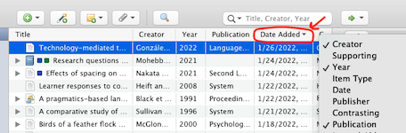
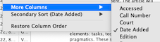
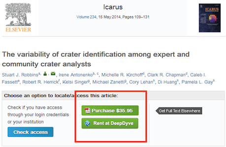
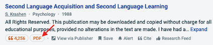

## 1.1. Understanding the field: second language acquisition and applied linguistics

  <i class="fa-solid fa-file-lines"></i> Ellis, R. (2021). A short history of SLA: Where have we come from and where are we going? _Language Teaching_. https://doi.org/10.1017/S0261444820000038



Key terms:

- Applied Linguistics (AL)
  - in theory: linguistics in many social applications, incl. forensic linguistics, etc.
  - often: applied only to language learning and teaching
- Second Language Acquisition (SLA)
   ≃ Foreign/Second Language Learning
- Language Teaching
   ≃ Instructed Second Language Acquisition
- Computer-Assisted Language Learning
   ≃ Language Learning & Technology
   ≃ Technology-enhanced Language Learning (and other terms)
- Language Testing / Language Assessment

### Differentiating academic documents

- Book
  - Edited book (e.g., _Handbooks_)
  - Chapter/section in an edited book
- Journal article
- Paper in conference proceedings
  - Unpublished presentation at a conference
- Theses and dissertations
- Working papers and reports

### Main journals in the field

See my [List of Journals in Linguistics and Language Learning]()

→ Browsing journals to get an idea of the field

See also the [Open Accessible Summaries in Language Studies (OASIS) Database](https://oasis-database.org/).

## 1.2. Finding scientific literature

### Searching for scientific literature

<!--  -->

#### Search engines

<!--  -->

- [Dimensions](https://app.dimensions.ai/discover/publication) (>130M publications) ⭐: useful search filtering tools (year, categories, authors...), useful citation statistics to rank publications by impact. Volume (130M) makes it a relatively good free alternative to Scopus and Web of Science.
- [Elicit](https://www.elicit.org): AI-powered search engine for research questions, which summarises the main findings of each paper.
- [Google Scholar](https://scholar.google.com/) (>400M publications): most complete (the best if you want exhaustiveness), but a lot of noise (low-quality papers) and suboptimal ordering.
- [SemanticScholar](https://www.semanticscholar.org) (>200M): better ordering and interesting insights on citation flow + [helps you obtain the PDF](#accessing-papers), but incomplete citation data.
- [ResearchRabbit](https://www.researchrabbit.ai/): interesting AI-based search to start a literature review by expanding from one source; also useful to keep track of new publications (scientific watch).

#### Scientific databases

In comparison with search engines, databases include _less_ publications. They have more strict inclusion criteria for journals and publications, which tend to leave out less important publishers, languages and documents.

Main limitation: the most important databases (Scopus and Web of Science) require a paid subscription by your university. They also favour journal articles, and hence empirical studies, over books and book chapters, which are an important source of literature reviews.

Especially useful if needing to establish a robust, finite and replicable set of publications (e.g., for a [research synthesis](2-summarizing/2-2-literature-review.mdsearch-synthesis-vs-literature-review)). They might also help you identify the most important/reliable sources at the beginning of your research journey.

- [Scopus](https://www.scopus.com/home.uri) ⭐ (~80M publications)
- [Web of Science](https://www.webofknowledge.com/) ⭐ (~85M)
- [EBSCOHost](https://search.ebscohost.com/) (~132M)
- [ProQuest](https://www.proquest.com/) (~280M)

Regional databases, focused on specific languages (Spanish, French...) and disciplinary databases, focused on specific subjects, have the major disadvantage of being smaller by multiple orders of magnitude and thus only including a very small portion of the available research.

- [ERIC](https://eric.ed.gov/) (~1.7M publications): focused on education, but might not include all journals on language learning (and does include some predatory journals).
- [Dialnet](https://dialnet.unirioja.es/) (~8M): focus on Spain.
- [Redalyc](https://www.redalyc.org/) (~0.8M): focus on Mexico & Lat. Am.
- [Scielo](https://scielo.org/es/) (~0.5M): focus on Brazil & Chile.

### Organizing papers: reference management

#### Reference management software

- ==**[Zotero](https://www.zotero.org/download/)**== (strongly recommended)
  - advantages:
    - auto import citation data from websites (with Zotero Connector)
    - auto identification of PDF files (finds good citation metadata based on the PDF, but still needs some manual check afterwards)
    - integration with Word
    - free & open source
    - powerful, endless possibilities of tagging, notes, exports, collaboration (with Zotero Groups)
  - also install the [Zotero Connector](https://www.zotero.org/download/connectors) browser extension (for [Firefox](https://www.zotero.org/download/connector/dl?browser=firefox), [Chrome](https://chrome.google.com/webstore/detail/ekhagklcjbdpajgpjgmbionohlpdbjgc), [Safari](https://www.zotero.org/support/kb/safari_12_connector) or [Edge](https://microsoftedge.microsoft.com/addons/detail/nmhdhpibnnopknkmonacoephklnflpho))
  - [Quick start guide](https://www.zotero.org/support/quick_start_guide)
  - **Recommended extensions**:
    - [scite](https://github.com/scitedotai/scite-zotero-plugin) for citations count; otherwise [Zotero Citation Counts Manager](https://github.com/eschnett/zotero-citationcounts).
    - [Better BibTeX for Zotero](https://retorque.re/zotero-better-bibtex/) if you use LaTeX (not necessary for most people).
    - [Attanger](https://github.com/MuiseDestiny/zotero-attanger) or [Zotfile](https://www.zotfile.com/) to organize PDF files on your computer.
  - **Recommended configuration**:
    - Add column "Date Added" (in _More columns_) to order items by last added: this way you see on top the last publications you have found.
       
    - Create a free account on Zotero and use it to sync your library.
      - If you have many PDFs, use [Attanger](https://github.com/MuiseDestiny/zotero-attanger) or [Zotfile](https://www.zotfile.com/) to put the PDFs in a specific folder, avoiding syncing those via Zotero (saving space).
    - If you collaborate on a project, create a Group and a shared library.
- **[Mendeley](https://www.mendeley.com/)** (also quite good, but less powerful than Zotero, and proprietary, owned by Elsevier).

#### One-time bibliography generation:

- [ZoteroBib](https://zbib.org/)
- [CiteThisForMe](https://www.citethisforme.com/)

### Accessing papers

**How to access full-text papers?** (e.g., in PDF)

Many quality papers from international journals are sadly behind _paywalls_: if your university does not have a subscription (which is very rare in Ecuador), you have to pay for the PDF. ==Do not pay for one paper!== It's too expensive for a single publication, especially if you're not sure how good or relevant it's going to be. And authors don't get a single cent from scientific publications.

There are solutions:

- **Open access** journals/papers: some papers are free to download (🔓).
- **Repositories**: many authors now publish a full version (often a _<abbr title="Alternate version of the PDF, without the journal styling, matching the content before the last round of revision/copy-editing.">preprint</abbr>_) on a personal website or an institutional repository (a website from their university which contains all publications by the university's faculty), or on "academic social networks" such as [ResearchGate](https://www.researchgate.net/).
  - **[SemanticScholar](https://www.semanticscholar.org/)** is pretty good at finding freely available versions of publications: search for the full title and see if there is a PDF link.
    
    <!-- * [Microsoft Academic](https://academic.microsoft.com/) also provides you with links to the PDF when available. -->
    <!--  -->
- University library and proxy access for some subscribed content:
  - Access the publisher's website through your university proxy, if your university has a subscription (sadly very rare in Ecuador and the Global South, because too expensive for most universities).
- As a last resort, **e-mail the first author** asking for the PDF: most people will gladly send it to you.

Not fully legal solutions:

- ==**[Sci-Hub](https://sci-hub.se/)**== for papers (not legal, but considered legitimate by the large majority of the scientific community).
  - Search for the DOI, URL or full title of the paper.
    <!--  -->
- ==**[Library Genesis](https://www.libgen.gs/)**== for books (more problematic in terms of copyright infringement than Sci-Hub).
  - You won't find all books, so search by keywords to see what is available.
    <!--  -->

### Prioritising the literature

#### Identifying key sources (when starting researching a topic)

Criteria:

- **Citation count/year**
  - When comparing publications' citation count, normalize by year since publication:
    <small>a paper from last year with 10 citations is actually more influential (10 citations/year) than one from 20 years ago with 100 citations (5 citations/year).</small>
- **Recentness**
  - Most recent papers will refer to other important recent publications.
- **Tools**
  - [SemanticScholar](https://www.semanticscholar.org/): **Highly influential papers**
  - [ResearchRabbit](https://www.researchrabbit.ai/) can help to identify most cited/relevant papers
  - [Elicit](https://www.elicit.org)
- Snowballing: start from a few key papers and look at their references.

#### Categorizing sources

  
  
  J. Hayton, _[Day 12: How to filter the academic literature](https://jameshaytonphd.com/quick-tips/day-12)_ (2018)

- A: best + most relevant → read and re-read
- B: high quality + relevant, but not essential
- C: maybe interesting (ok quality, not clearly relevant) → keep for later
- D: not relevant at all / low quality → throw away/do not spend time

## 1.3. Reading and taking notes for writing

<i class="fa-solid fa-book"></i> Lundin, E. (2021). _How to write a killer research paper (even if you hate writing)_ [blog post]. College Info Geek. https://collegeinfogeek.com/how-to-write-a-research-paper/

- Skimming and identifying relevant information
- Synthesis matrix (for contrasting theoretical perspectives)
- Summary table of studies (for summarizing empirical studies)
- Outlining for note-taking
  - Outlining software:
    - [Obsidian](https://obsidian.md/) (recommended)
    - [Workflowy](https://workflowy.com/invite/3165e47f.lnx)
    - [Notion](https://www.notion.so/)
    - Microsoft OneNote (not recommended)
- Preparing to write
  - Hierarchical outline
  - Flat outline
