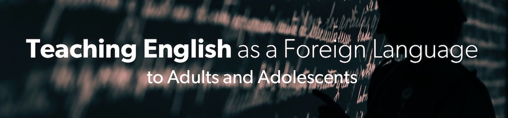



## Units

- Part 1: [Theories & Methods of Second Language Acquisition](1-theories-methods)
- Part 2: [Towards a communicative syllabus](2-syllabus)
- Part 3: [Lesson design and teaching](3-lesson-design)
- Part 4: [Above and beyond: tasks and content](4-above-beyond)

<!-- ## What you will learn

- Fundamental Python programming skills
- Statistical concepts and how to apply them in practice
- Gain experience with the Scikit, including data visualization with Plotly and data wrangling with Pandas

## Program overview

The demand for skilled data science practitioners is rapidly growing. Lorem ipsum dolor sit amet, consectetur adipiscing elit. Duis posuere tellus ac convallis placerat. Proin tincidunt magna sed ex sollicitudin condimentum. Sed ac faucibus dolor, scelerisque sollicitudin nisi.

## Courses in this program



## Meet your instructor



## FAQs


There are no prerequisites for the first course.



Continuously, at your own pace.


 -->
